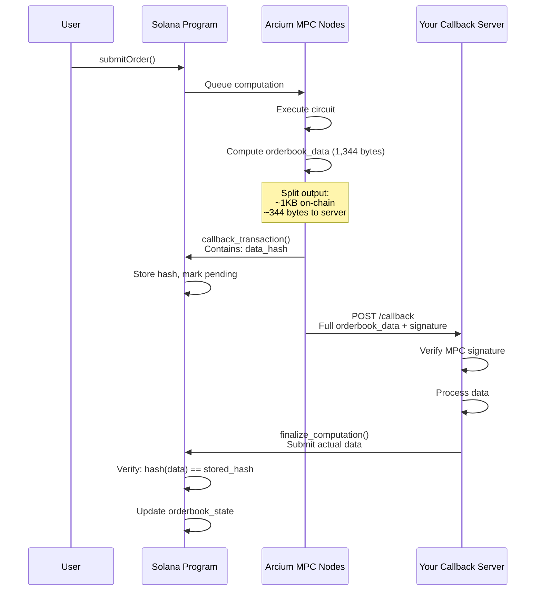

# Implementing a Callback Server for Large OrderBook Data

## Problem Statement

Your `OrderBook` structure is too large (42 ciphertext chunks = 1,344 bytes) to fit in a single Solana callback transaction (limit ~1KB). When you return `Enc<Mxe, OrderBook>` from your circuits, the test stalls because Arcium cannot deliver the large payload via a normal on-chain callback.

**Solution:** Implement a **Callback Server** - an HTTP server that receives large computation outputs from MPC nodes, verifies them, and submits them on-chain.

---

## How It Works

### Normal Flow (Small Outputs)
```
User → Submit Order → MPC Computation → Direct Callback (on-chain) → Program Updates State
```

### With Callback Server (Large Outputs)
```
User → Submit Order → MPC Computation 
                         ↓
                    [Split Output]
                         ↓
              ┌──────────┴──────────┐
              ↓                     ↓
         On-chain Callback    HTTP Callback to Your Server
         (hash of data)       (actual large data)
              ↓                     ↓
         Program stores       Server verifies signature
         data hash           Server processes data
              ↓                     ↓
              └──────────┬──────────┘
                         ↓
              Server calls finalize() on-chain
              Program verifies: hash(server_data) == stored_hash
                         ↓
                   ✅ Success!
```

---

## Architecture Overview



---

## Implementation Steps

### Step 1: Set Up Callback Server (Node.js/Express)

Create `callback-server/index.ts`:

```typescript
import express from 'express';
import { Connection, Keypair, PublicKey } from '@solana/web3.js';
import * as anchor from '@coral-xyz/anchor';
import nacl from 'tweetnacl';

const app = express();
app.use(express.raw({ type: '*/*', limit: '10mb' })); // Accept raw bytes

interface CallbackPayload {
  mempoolId: number;
  compDefOffset: number;
  txSig: Buffer;
  dataSig: Buffer;
  pubKey: Buffer;
  data: Buffer;
}

function parseCallbackPayload(rawBytes: Buffer): CallbackPayload {
  let offset = 0;
  
  // mempool_id: u16 (2 bytes)
  const mempoolId = rawBytes.readUInt16LE(offset);
  offset += 2;
  
  // comp_def_offset: u32 (4 bytes)
  const compDefOffset = rawBytes.readUInt32LE(offset);
  offset += 4;
  
  // tx_sig: [u8; 64] (64 bytes)
  const txSig = rawBytes.slice(offset, offset + 64);
  offset += 64;
  
  // data_sig: [u8; 64] (64 bytes)
  const dataSig = rawBytes.slice(offset, offset + 64);
  offset += 64;
  
  // pub_key: [u8; 32] (32 bytes)
  const pubKey = rawBytes.slice(offset, offset + 32);
  offset += 32;
  
  // data: Vec<u8> (remaining bytes)
  const data = rawBytes.slice(offset);
  
  return {
    mempoolId,
    compDefOffset,
    txSig,
    dataSig,
    pubKey,
    data,
  };
}

function verifySignature(
  data: Buffer,
  signature: Buffer,
  publicKey: Buffer
): boolean {
  try {
    return nacl.sign.detached.verify(data, signature, publicKey);
  } catch (error) {
    console.error('Signature verification failed:', error);
    return false;
  }
}

app.post('/callback', async (req, res) => {
  console.log('📥 Received callback from MPC node');
  console.log('Content-Type:', req.headers['content-type']);
  console.log('Content-Length:', req.headers['content-length']);
  
  try {
    const rawBytes = req.body as Buffer;
    const payload = parseCallbackPayload(rawBytes);
    
    console.log('📦 Parsed payload:');
    console.log('  Mempool ID:', payload.mempoolId);
    console.log('  Comp Def Offset:', payload.compDefOffset);
    console.log('  TX Sig:', payload.txSig.toString('hex').slice(0, 20) + '...');
    console.log('  Data Sig:', payload.dataSig.toString('hex').slice(0, 20) + '...');
    console.log('  MPC Node PubKey:', payload.pubKey.toString('hex'));
    console.log('  Data Length:', payload.data.length, 'bytes');
    
    // 1. Verify the signature
    const isValid = verifySignature(
      payload.data,
      payload.dataSig,
      payload.pubKey
    );
    
    if (!isValid) {
      console.error('❌ Invalid signature from MPC node!');
      return res.status(401).json({ error: 'Invalid signature' });
    }
    
    console.log('✅ Signature verified');
    
    // 2. Process the data (parse orderbook_data)
    const orderbookData = parseOrderbookData(payload.data);
    console.log('📊 Orderbook data parsed:', {
      buyCount: orderbookData.buyCount,
      sellCount: orderbookData.sellCount,
    });
    
    // 3. Submit finalization transaction on-chain
    await submitFinalization(
      payload.compDefOffset,
      payload.data,
      payload.txSig.toString('hex')
    );
    
    console.log('✅ Callback processed successfully');
    res.status(200).json({ success: true });
    
  } catch (error) {
    console.error('❌ Error processing callback:', error);
    res.status(500).json({ error: error.message });
  }
});

function parseOrderbookData(data: Buffer): any {
  // Parse the encrypted orderbook data
  // Format: [[u8; 32]; 42] = 42 ciphertext chunks
  const chunks: Uint8Array[] = [];
  for (let i = 0; i < 42; i++) {
    chunks.push(data.slice(i * 32, (i + 1) * 32));
  }
  
  return {
    chunks,
    buyCount: 0, // You'd extract this from metadata if needed
    sellCount: 0,
  };
}

async function submitFinalization(
  compDefOffset: number,
  data: Buffer,
  txSigHex: string
): Promise<void> {
  console.log('📤 Submitting finalization transaction...');
  
  // Load your program
  const connection = new Connection('http://127.0.0.1:8899', 'confirmed');
  const wallet = Keypair.fromSecretKey(/* your keypair */);
  const provider = new anchor.AnchorProvider(connection, new anchor.Wallet(wallet), {});
  const program = /* your program instance */;
  
  // Convert data to the format your program expects
  const orderbookChunks = [];
  for (let i = 0; i < 42; i++) {
    orderbookChunks.push(Array.from(data.slice(i * 32, (i + 1) * 32)));
  }
  
  // Call your program's finalize instruction
  const tx = await program.methods
    .finalizeSubmitOrder(orderbookChunks)
    .accounts({
      orderbookState: /* PDA */,
      authority: wallet.publicKey,
    })
    .rpc();
  
  console.log('✅ Finalization tx:', tx);
}

const PORT = process.env.PORT || 3000;
app.listen(PORT, () => {
  console.log(`🚀 Callback server listening on port ${PORT}`);
  console.log(`📍 Endpoint: http://localhost:${PORT}/callback`);
});
```

---

### Step 2: Update Your Solana Program

Add a **finalize instruction** that accepts the large data and verifies it against the stored hash:

**In `programs/matching_engine/src/lib.rs`:**

```rust
#[arcium_callback(encrypted_ix = "submit_order", network = "localnet")]
pub fn submit_order_callback(
    ctx: Context<SubmitOrderCallback>,
    output: ComputationOutputs<SubmitOrderOutput>,
) -> Result<()> {
    // This callback now ONLY stores the hash and marks computation as pending
    match &output {
        ComputationOutputs::Success(SubmitOrderOutput { field_0 }) => {
            // field_0 contains:
            // - orderbook_hash (if using callback server)
            // - ledger_enc (full data, fits in transaction)
            // - status_enc (full data, fits in transaction)
            // - success (bool)
            
            let orderbook_hash = &field_0.field_0; // Hash of the orderbook
            let ledger_enc = &field_0.field_1;
            let status_enc = &field_0.field_2;
            let success = field_0.field_3;
            
            // Store hash, mark as pending finalization
            ctx.accounts.orderbook_state.pending_orderbook_hash = Some(*orderbook_hash);
            ctx.accounts.orderbook_state.pending_finalization = true;
            
            // Update ledger and order (these fit in the callback)
            ctx.accounts.user_ledger.balance_nonce = ledger_enc.nonce;
            ctx.accounts.user_ledger.encrypted_balances = ledger_enc.ciphertexts;
            
            ctx.accounts.order_account.order_nonce = status_enc.nonce;
            ctx.accounts.order_account.encrypted_order = status_enc.ciphertexts;
            
            msg!("Callback received, awaiting finalization");
            Ok(())
        }
        _ => Err(ErrorCode::AbortedComputation.into()),
    }
}

// New instruction: Called by callback server with full data
pub fn finalize_submit_order(
    ctx: Context<FinalizeSubmitOrder>,
    orderbook_data: [[u8; 32]; 42], // The full data from callback server
) -> Result<()> {
    let orderbook_state = &mut ctx.accounts.orderbook_state;
    
    // 1. Verify we're expecting a finalization
    require!(
        orderbook_state.pending_finalization,
        ErrorCode::NotPendingFinalization
    );
    
    // 2. Compute hash of submitted data
    let submitted_hash = hash(&orderbook_data);
    
    // 3. Verify it matches the hash from the MPC callback
    let expected_hash = orderbook_state.pending_orderbook_hash
        .ok_or(ErrorCode::NoPendingHash)?;
    
    require!(
        submitted_hash == expected_hash,
        ErrorCode::HashMismatch
    );
    
    // 4. Hash matches! Store the data
    orderbook_state.orderbook_data = orderbook_data;
    orderbook_state.pending_finalization = false;
    orderbook_state.pending_orderbook_hash = None;
    
    msg!("Orderbook finalized successfully");
    Ok(())
}

#[derive(Accounts)]
pub struct FinalizeSubmitOrder<'info> {
    #[account(mut)]
    pub orderbook_state: Account<'info, OrderBookState>,
    
    #[account(constraint = authority.key() == orderbook_state.authority)]
    pub authority: Signer<'info>,
}
```

**Update `OrderBookState`:**

```rust
#[account]
pub struct OrderBookState {
    pub authority: Pubkey,
    pub orderbook_data: [[u8; 32]; 42],
    pub orderbook_nonce: u128,
    pub backend_pubkey: [u8; 32],
    pub base_mint: Pubkey,
    pub quote_mint: Pubkey,
    pub last_match_timestamp: i64,
    pub total_orders_processed: u64,
    pub total_matches: u64,
    pub bump: u8,
    
    // New fields for callback server pattern
    pub pending_finalization: bool,      // Is there a pending finalization?
    pub pending_orderbook_hash: Option<[u8; 32]>, // Hash of pending data
}
```

---

### Step 3: Configure Arcium to Use Your Callback Server

When initializing your computation definition, register your callback server URL:

**In your test setup:**

```typescript
import { initCompDef } from '@arcium-hq/client';

// Initialize comp def with callback server URL
await program.methods
  .initSubmitOrderCompDef()
  .accounts({
    // ... accounts
  })
  .preInstructions([
    // Register callback server URL with Arcium
    await arciumProgram.methods
      .registerCallbackServer(
        compDefPDA,
        "http://localhost:3000/callback" // Your server URL
      )
      .accounts({
        // ... arcium accounts
      })
      .instruction()
  ])
  .rpc();
```

**NOTE:** Check the Arcium SDK for the exact method to register a callback server. This might be done during comp def initialization or as a separate instruction.

---

### Step 4: Update Your Circuit

The circuit remains the same - it still returns the full `Enc<Mxe, OrderBook>`. Arcium will automatically detect that the output is too large and route it to your callback server:

```rust
#[instruction]
pub fn submit_order(
    user_sensitive: Enc<Shared, UserSensitiveData>,
    user_ledger: Enc<Mxe, &Balances>,
    orderbook_ctx: Enc<Mxe, &OrderBook>,
    order_id: u64,
    order_type: u8,
    timestamp: u64,
) -> (
    Enc<Mxe, OrderBook>,      // ← Large! Will go to callback server
    Enc<Mxe, Balances>,       // ← Fits in normal callback
    Enc<Shared, OrderStatus>, // ← Fits in normal callback
    bool,                     // ← Fits in normal callback
) {
    // ... your existing logic
    
    (
        orderbook_ctx.owner.from_arcis(orderbook),
        user_ledger.owner.from_arcis(ledger),
        user_sensitive.owner.from_arcis(status),
        success.reveal(),
    )
}
```

---

## Deployment Steps

1. **Start your callback server:**
   ```bash
   cd callback-server
   npm install express @solana/web3.js @coral-xyz/anchor tweetnacl
   npm install -D @types/express @types/node
   ts-node index.ts
   ```

2. **Make it accessible to MPC nodes:**
   - For local testing: Use `ngrok` or `localhost.run` to expose localhost:3000
   ```bash
   ngrok http 3000
   # Use the ngrok URL (e.g., https://abc123.ngrok.io/callback) in your comp def
   ```

3. **For production:** Deploy to a cloud service (AWS, GCP, Heroku, Vercel)

4. **Register the URL** with your computation definition

5. **Run your test** - the flow will now be:
   - User submits order → MPC computes → callback server receives data → server finalizes on-chain

---

## Security Considerations

1. **Signature Verification:** ALWAYS verify the `data_sig` using the MPC node's `pub_key`. This ensures the data actually came from an Arcium MPC node.

2. **Hash Verification:** On-chain, ALWAYS verify that `hash(submitted_data) == stored_hash`. This ensures the data wasn't tampered with between the MPC node and your server.

3. **HTTPS:** In production, use HTTPS for your callback server to prevent man-in-the-middle attacks.

4. **Rate Limiting:** Implement rate limiting to prevent DoS attacks on your callback endpoint.

5. **Authorized Finalizers:** Only allow your backend wallet (stored in `OrderBookState.authority`) to call `finalize_submit_order`.

---

## Testing Locally

```bash
# Terminal 1: Start Solana localnet
solana-test-validator

# Terminal 2: Start Arcium localnet
arcium start

# Terminal 3: Start callback server
cd callback-server && ts-node index.ts

# Terminal 4: Run tests
arcium test
```

---

## Alternative: Avoid Callback Server by Changing Architecture

If you want to avoid the complexity of a callback server, consider:

### Option A: Store Orders Individually
```rust
// Instead of one big OrderBook, each order is its own PDA
#[account]
pub struct OrderPDA {
    pub order_id: u64,
    pub encrypted_data: [u8; 32], // Just this one order
    pub user: Pubkey,
}

// OrderBookState just tracks metadata
#[account]
pub struct OrderBookState {
    pub total_orders: u64,
    pub total_matches: u64,
    // No orderbook_data!
}
```

### Option B: Off-Chain Orderbook
- Keep the orderbook off-chain in your backend
- MPC only validates balances
- Emit events for orders
- Backend matches orders off-chain
- Settlement happens on-chain atomically

This is how real DEXs like Serum/OpenBook work!

---

## Recommendation

For a dark pool with encrypted orders, I recommend **Option B (Off-Chain Orderbook)** because:
1. Simpler architecture (no callback server needed)
2. Better scalability (no on-chain orderbook size limits)
3. Lower transaction costs
4. Faster matching (off-chain is faster than MPC)

The MPC layer only needs to:
- Validate user balances (prevent overdraft)
- Encrypt order details for privacy
- Enable backend to decrypt and match

Would you like me to help you implement the **callback server** approach or pivot to the **off-chain orderbook** architecture?
