# Dark Pool Trading Platform - Technical Architecture (2 Min Overview)

---

## 1. What We're Building (15 seconds)

**A fully private dark pool trading platform where:**
- Order details (amount, price) are **encrypted end-to-end**
- Balances are tracked **encrypted on-chain** via MPC
- In-app settlement with **zero visibility** to platform operators
- Minimal attack surface through **client-side encryption + MPC validation**


---

## 2. Core Architecture - Three Layers (30 seconds)

### Layer 1: On-Chain Program (Solana)

**Per Token Pair Deployment:**
- Each trading pair (SOL/USDC, ETH/USDC) = separate program instance
- Manages two token vaults (base + quote)
- Stores **encrypted** user ledgers and orderbook

**Key Accounts:**


**Privacy Guarantees:**
- ❌ Platform CANNOT see user balances
- ❌ Platform CANNOT see order details
- ❌ Platform CANNOT front-run orders
- ✅ Only MPC network validates and updates encrypted data

---

### Layer 2: MPC Network (Arcium)

**Encrypted Computation Flow:**

```mermaid
sequenceDiagram
    participant User
    participant Program
    participant MPC
    
    User->>Program: submitOrder(encrypted_amount, encrypted_price)
    Program->>MPC: Validate balance + Update orderbook
    MPC->>MPC: Decrypt → Compute → Re-encrypt
    MPC->>Program: Callback with encrypted results
    Program->>Program: Store encrypted orderbook hash
    Program->>Program: Emit MatchEvent (encrypted)
```



**Two Encryption Schemes:**
1. **Shared Encryption** (User's x25519 key) - Order status visible to user only
2. **MXE Encryption** (MPC-only) - Balances and orderbook, totally private

---

### Layer 3: Cranker Service (Backend) (30 seconds)

**Event-Driven Settlement:**


**Cranker Responsibilities:**
1. **Listen** to `MatchesFoundEvent` (emitted by program)
2. **Decrypt** match results using cranker's x25519 private key
3. **Execute Settlement** - atomic SPL token transfers between users
4. **Update Balances** - trigger MPC to update encrypted ledgers

**Attack Surface Minimization:**
- Cranker CANNOT see user balances (MXE encrypted)
- Cranker CANNOT modify match results (hash-verified on-chain)
- Cranker CANNOT steal funds (token transfers validated by program)
- Cranker ONLY orchestrates - doesn't hold custody

---

## 3. Frontend - Client-Side Encryption (20 seconds)

**Dual-Key System:**


**Key Management:**
1. **Solana Wallet (ed25519)** - Transaction signing, public identity
2. **Encryption Keypair (x25519)** - Order/balance encryption
   - Generated client-side on first use
   - Encrypted with wallet signature
   - Stored in localStorage
   - Recoverable via wallet signature

**Why localStorage?**
- ✅ Persistent across sessions
- ✅ Protected by wallet signature encryption
- ✅ User doesn't manage another keypair manually
- ✅ Lost if wallet lost (intentional - privacy-first)

---

## 4. In-App Settlement Flow (25 seconds)

**Complete Order Lifecycle:**

```mermaid
sequenceDiagram
    autonumber
    participant Alice
    participant Program
    participant MPC
    participant Cranker
    participant Bob
    
    Alice->>Program: Deposit 100 USDC
    Program->>MPC: Update Alice's encrypted balance
    MPC-->>Program: ✅ Balance updated
    
    Alice->>Program: Submit BUY 10 SOL @ 5 USDC
    Program->>MPC: Validate balance (need 50 USDC)
    MPC->>MPC: Check: 100 ≥ 50 ✅
    MPC->>MPC: Lock 50 USDC, Add to orderbook
    MPC-->>Program: Encrypted orderbook + status
    
    Bob->>Program: Submit SELL 10 SOL @ 5 USDC
    Program->>MPC: Validate balance + Match
    MPC->>MPC: Match found! (Buy@5 meets Sell@5)
    MPC-->>Program: Emit MatchEvent (encrypted)
    
    Cranker->>Program: Listen to MatchEvent
    Cranker->>Cranker: Decrypt match details
    Cranker->>Program: executeSettlement(Alice, Bob, 10 SOL, 50 USDC)
    Program->>Program: Transfer 10 SOL: Vault→Alice
    Program->>Program: Transfer 50 USDC: Vault→Bob
    Program->>MPC: Update both ledgers
    MPC-->>Program: ✅ Settlement complete
```



**Key Innovation: No Custody**
- Users deposit to **program-owned vaults** (not cranker)
- Settlement is **atomic on-chain** (both legs or neither)
- Balances updated **via MPC** (encrypted state transitions)
- Zero trust in cranker - it's just an orchestrator

---

## 5. Security Properties (10 seconds)

### Minimal Attack Surface

| Component | Can See Orders? | Can See Balances? | Can Steal Funds? |
|-----------|----------------|-------------------|------------------|
| **User** | Own only (Shared enc) | Own only (events) | Own only |
| **Platform Operator** | ❌ No | ❌ No | ❌ No |
| **Cranker** | ❌ No (hash only) | ❌ No | ❌ No |
| **MPC Network** | ✅ During computation | ✅ During computation | ❌ No |
| **Solana Validators** | ❌ Encrypted | ❌ Encrypted | ❌ Program controlled |

### Threat Model

```mermaid
graph TD
    A[Malicious Cranker] -->|Tries to| B{Attack Vectors}
    B -->|See balances?| C[❌ MXE encrypted]
    B -->|Modify matches?| D[❌ Hash verified on-chain]
    B -->|Front-run orders?| E[❌ Orders encrypted]
    B -->|Steal funds?| F[❌ Program-controlled vaults]
    
    style C fill:#9f9
    style D fill:#9f9
    style E fill:#9f9
    style F fill:#9f9
```



**Trust Assumptions:**
- ✅ Trust Solana consensus
- ✅ Trust Arcium MPC network (decentralized threshold)
- ❌ Zero trust in platform operator
- ❌ Zero trust in cranker service

---

## 6. Event-Driven Architecture (10 seconds)

**Why Events Instead of Queries?**


**Benefits:**
1. **Real-time** - No polling needed
2. **Privacy-preserving** - Events contain encrypted data
3. **Auditable** - Full history on-chain
4. **Scalable** - Cranker can be horizontally scaled

---

## 7. Key Differentiators (10 seconds)

### vs Traditional Dark Pools (TradFi)
- ❌ TradFi: Centralized, custodial, trust required
- ✅ Ours: Decentralized, non-custodial, trustless

### vs Public DEXs (Uniswap, Jupiter)
- ❌ Public DEX: All orders visible, front-runnable
- ✅ Ours: Orders encrypted, front-running impossible

### vs Private DEXs (Existing)
- ❌ Others: Off-chain matching, centralized sequencer
- ✅ Ours: On-chain encrypted orderbook, MPC validation

---

## 8. Technical Stack Summary (5 seconds)

```
┌─────────────────────────────────────────┐
│          Frontend (React + TS)          │
│   - Solana Wallet Adapter               │
│   - @arcium/client (x25519 encryption)  │
│   - Event listeners for real-time UI    │
└─────────────────┬───────────────────────┘
                  │
┌─────────────────▼───────────────────────┐
│     Solana Program (Rust + Anchor)      │
│   - UserPrivateLedger (MXE encrypted)   │
│   - OrderBook (MXE encrypted)           │
│   - OrderAccount (Shared encrypted)     │
│   - Token Vaults (SPL tokens)           │
└─────────────────┬───────────────────────┘
                  │
        ┌─────────┴─────────┐
        │                   │
┌───────▼────────┐  ┌──────▼──────────┐
│  Arcium MPC    │  │ Cranker Service │
│  - Balance     │  │ - Event listener│
│    validation  │  │ - Settlement    │
│  - Order       │  │   execution     │
│    matching    │  │ - No custody    │
└────────────────┘  └─────────────────┘
```

---

## 9. Current Status & Demo

### ✅ Implemented
- User ledger initialization (encrypted)
- Deposit/withdraw with balance updates
- Client-side x25519 key management
- Event-driven UI updates

### 🚧 In Progress
- Order submission (callback server for large data)
- Order matching circuit
- Cranker settlement service

### 🎯 Demo Shows
- **Encrypted balance tracking** via MPC
- **Privacy-preserving deposits/withdrawals**
- **Zero-knowledge** of user holdings

---

## Conclusion (5 seconds)

**We've built a fully private dark pool where:**
1. 🔒 **All sensitive data encrypted** (balances, orders, matches)
2. 🔐 **MPC validates** without seeing plaintext
3. 🎯 **Minimal attack surface** - even we can't see your data
4. ⚡ **Event-driven settlement** - real-time and trustless

**Privacy + Decentralization + Performance**

---

## Narration Script (Exactly 2 Minutes)

> [0:00-0:15] "We're building a dark pool trading platform with end-to-end encryption. Order details, balances, everything is encrypted on-chain using Arcium's MPC network. Even the platform operator can't see your data."

> [0:15-0:45] "The architecture has three layers. First, our Solana program manages token vaults and encrypted state - user ledgers and the orderbook are all MXE encrypted, meaning only the MPC network can compute on them. Each token pair is a separate program instance for isolation."

> [0:45-1:15] "Second layer is the MPC network. When you submit an order, it's encrypted with your x25519 key. The MPC decrypts, validates your balance, adds to the orderbook, and re-encrypts everything. It then emits an encrypted match event. We use two encryption schemes: Shared encryption for data users can decrypt, and MXE for balances that only MPC sees."

> [1:15-1:40] "Third layer is our cranker service. It listens to match events, decrypts them using its own key, and executes settlement by calling the program. The settlement is atomic token transfers on-chain. Crucially, the cranker can't see balances, can't modify matches due to hash verification, and can't steal funds since tokens are in program-controlled vaults."

> [1:40-1:55] "On the frontend, users have two keypairs: their Solana wallet for transactions, and an x25519 encryption keypair for orders. The encryption keypair is stored in localStorage, encrypted with the wallet signature, so it persists across sessions but is tied to their wallet."

> [1:55-2:00] "The result: a trustless dark pool with minimal attack surface where privacy is guaranteed by cryptography, not promises."

---

## Slide Deck Structure (if needed)

1. **Title Slide:** Dark Pool - Private Trading via MPC
2. **Problem:** Public DEXs = front-running, TradFi dark pools = trust
3. **Solution:** Encrypted orderbook + MPC validation + On-chain settlement
4. **Architecture Diagram:** Three layers (Program, MPC, Cranker)
5. **Security Model:** Attack surface analysis table
6. **Order Flow:** Sequence diagram of complete trade
7. **Key Innovation:** In-app settlement without custody
8. **Demo:** Live walkthrough of deposit/withdraw
9. **Status:** What works, what's next
10. **Thank You:** Contact/links

---

## Recording Tips

1. **Use Mermaid Live Editor** to render diagrams: https://mermaid.live/
2. **Highlight key terms** as you say them
3. **Point to specific components** in diagrams
4. **Keep pace steady** - 2 minutes is tight!
5. **Practice 3 times** before recording
6. **Use screen recording** to show actual demo at the end

---

## Key Messages to Emphasize

1. 🔒 **"Even we can't see your data"** - Trust minimized
2. ⚡ **"Settlement without custody"** - No funds held by platform
3. 🎯 **"Encrypted end-to-end"** - From client to MPC to storage
4. 🔐 **"MPC validates, not reveals"** - Computation on encrypted data

Good luck with your presentation! 🚀
