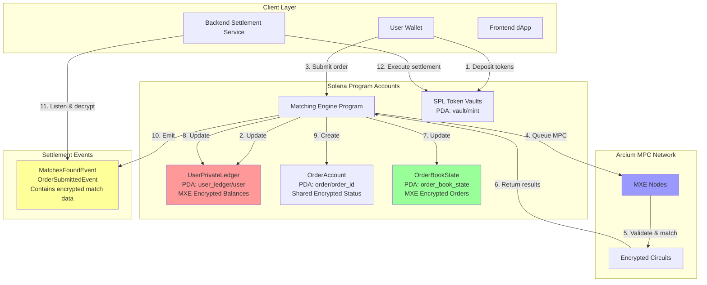
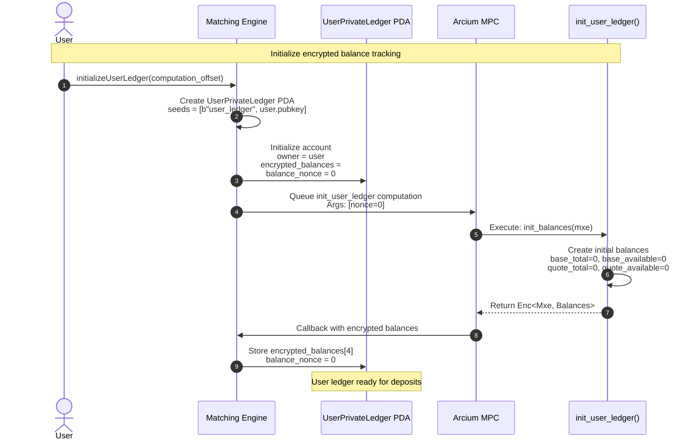
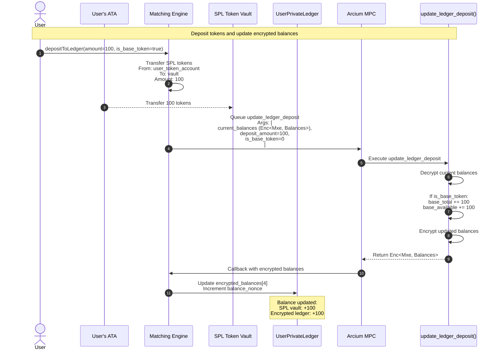
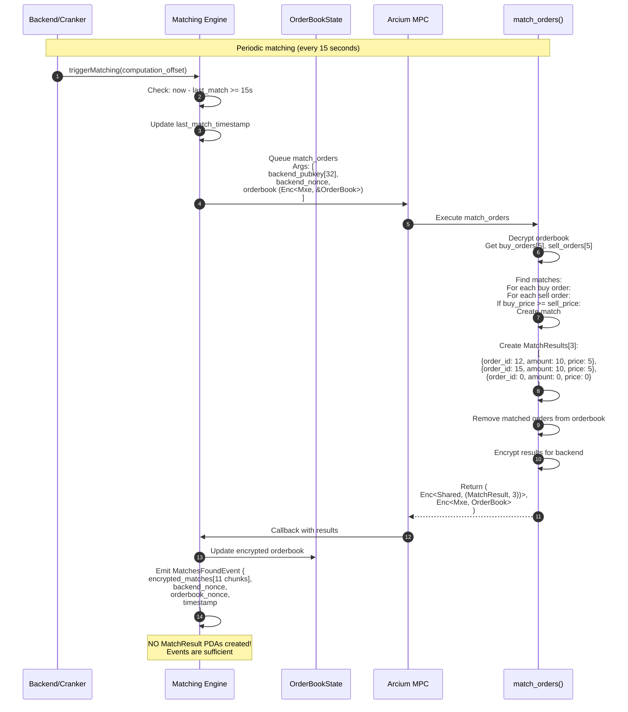
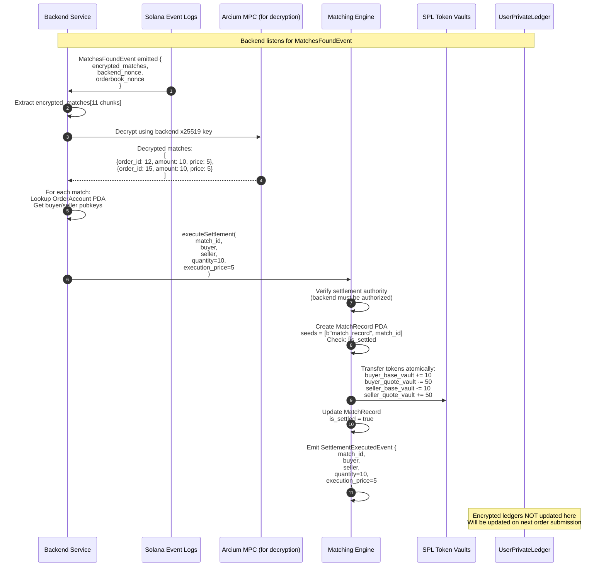
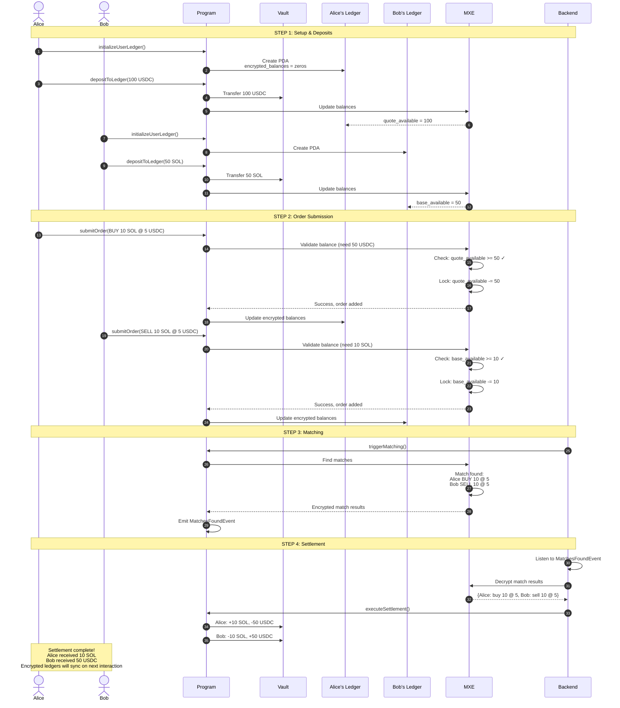
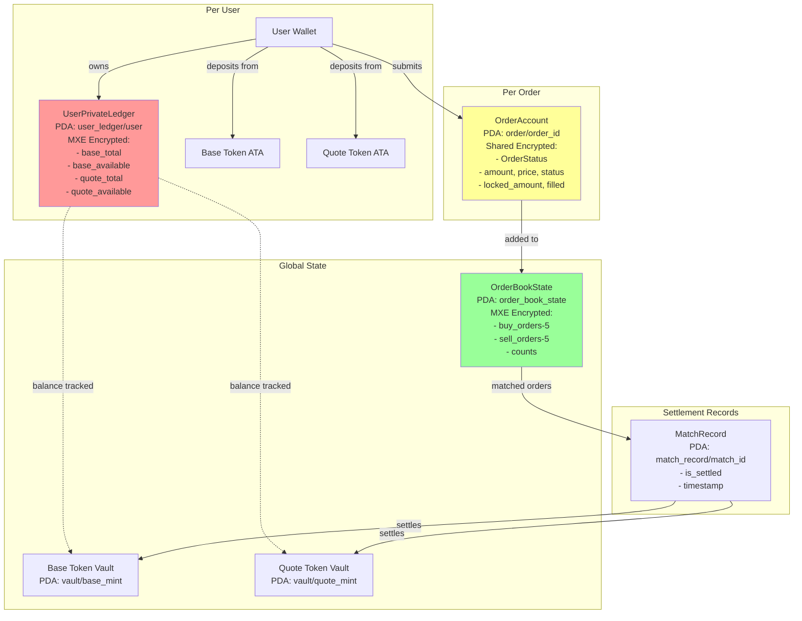
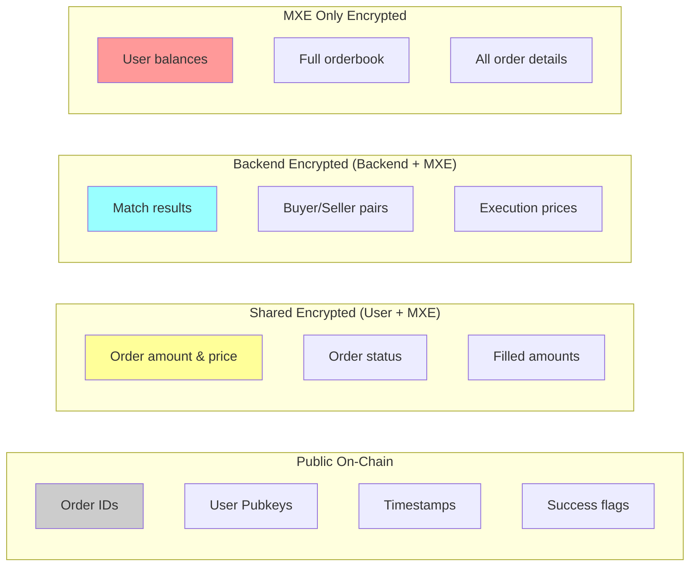

# Updated Dark Pool Architecture with In-App Settlement

## Table of Contents
- [Updated Dark Pool Architecture with In-App Settlement](#updated-dark-pool-architecture-with-in-app-settlement)
  - [Table of Contents](#table-of-contents)
  - [1. System Architecture Overview](#1-system-architecture-overview)
  - [2. User Ledger Initialization Flow](#2-user-ledger-initialization-flow)
  - [3. Deposit Flow](#3-deposit-flow)
  - [4. Order Submission with Balance Validation](#4-order-submission-with-balance-validation)
  - [5. Order Matching Flow](#5-order-matching-flow)
  - [6. Backend Settlement (Event-Based)](#6-backend-settlement-event-based)
  - [7. Complete End-to-End User Journey](#7-complete-end-to-end-user-journey)
  - [8. Account Relationships](#8-account-relationships)
  - [9. Data Privacy Levels](#9-data-privacy-levels)
  - [Summary: Key Design Decisions](#summary-key-design-decisions)

---

## 1. System Architecture Overview



**Key Changes:**
- **UserPrivateLedger**: MXE-encrypted balances (not backend-encrypted)
- **No MatchResult PDAs**: Events-only architecture
- **In-app settlement**: All balance tracking happens in-app via encrypted ledgers
- **Atomic settlement**: Backend listens to events and settles at SPL vault level

---

## 2. User Ledger Initialization Flow



**Circuit Signature:**
```rust
pub fn init_user_ledger(mxe: Mxe) -> Enc<Mxe, Balances> {
    mxe.from_arcis(Balances {
        base_total: 0,
        base_available: 0,
        quote_total: 0,
        quote_available: 0,
    })
}
```

---

## 3. Deposit Flow



**Circuit Signature:**
```rust
pub fn update_ledger_deposit(
    current_balances: Enc<Mxe, &Balances>,
    amount: u64,
    is_base_token: u8,
) -> Enc<Mxe, Balances> {
    let mut balances = *(current_balances.to_arcis());
    
    if is_base_token == 0 {
        balances.base_total += amount;
        balances.base_available += amount;
    } else {
        balances.quote_total += amount;
        balances.quote_available += amount;
    }
    
    current_balances.owner.from_arcis(balances)
}
```

---

## 4. Order Submission with Balance Validation

```mermaid
sequenceDiagram
    autonumber
    actor User
    participant FE as Frontend
    participant Program as Matching Engine
    participant Ledger as UserPrivateLedger
    participant OrderAcct as OrderAccount
    participant OB as OrderBookState
    participant MXE as Arcium MPC
    participant Circuit as submit_order()
    
    Note over User,Circuit: Submit order with in-app balance check
    
    User->>FE: Create order (amount=10, price=5, type=BUY)
    FE->>FE: Generate x25519 keypair
    FE->>FE: Get MXE public key
    FE->>FE: Encrypt [amount, price]
    
    FE->>Program: submitOrder(<br/>  encrypted_amount[32],<br/>  encrypted_price[32],<br/>  user_pubkey[32],<br/>  order_type=0,<br/>  order_id=12,<br/>  order_nonce=123<br/>)
    
    <!-- Note over Program: ⚠️ KEY ISSUE: How to pass encrypted struct? -->
    
    Program->>Program: Create OrderAccount PDA<br/>seeds = [b"order", order_id]
    
    Program->>MXE: Queue submit_order<br/>Args: [<br/>  user_sensitive (Enc<Shared, UserSensitiveData>),<br/>  user_ledger (Enc<Mxe, &Balances>),<br/>  orderbook (Enc<Mxe, &OrderBook>),<br/>  order_id=12,<br/>  order_type=0,<br/>  timestamp<br/>]
    
    <!-- Note over Program,MXE: 🔴 CURRENT PROBLEM:<br/>Passing Argument::EncryptedU64(amount)<br/>+ Argument::EncryptedU64(price)<br/>doesn't match Enc<Shared, Struct> -->
    
    MXE->>Circuit: Execute submit_order
    
    Circuit->>Circuit: Decrypt amount & price<br/>Decrypt user balances<br/>Decrypt orderbook
    
    Circuit->>Circuit: Calculate required:<br/>BUY: amount * price = 50<br/>Check: available_quote >= 50
    
    alt Sufficient Balance
        Circuit->>Circuit: Lock funds:<br/>quote_available -= 50
        Circuit->>Circuit: Add order to orderbook
        Circuit->>Circuit: Set status = PROCESSING
    else Insufficient Balance
        Circuit->>Circuit: Set status = INSUFFICIENT_BALANCE
    end
    
    Circuit-->>MXE: Return (<br/>  Enc<Mxe, OrderBook>,<br/>  Enc<Mxe, Balances>,<br/>  Enc<Shared, OrderStatus>,<br/>  success: bool<br/>)
    
    MXE->>Program: Callback with results
    
    Program->>OB: Update encrypted orderbook
    Program->>Ledger: Update encrypted balances
    Program->>OrderAcct: Store encrypted status
    
    Program->>Program: Emit OrderSubmittedEvent {<br/>  order_id=12,<br/>  user,<br/>  success=true<br/>}
```

**Circuit Signature:**
```rust
pub fn submit_order(
    user_sensitive: Enc<Shared, UserSensitiveData>,  // {amount: u64, price: u64}
    user_ledger: Enc<Mxe, &Balances>,
    orderbook_ctx: Enc<Mxe, &OrderBook>,
    order_id: u64,
    order_type: u8,  // 0=BUY, 1=SELL
    timestamp: u64,
) -> (
    Enc<Mxe, OrderBook>,      // Updated orderbook
    Enc<Mxe, Balances>,       // Updated ledger
    Enc<Shared, OrderStatus>, // For user decryption
    bool,                     // Success flag
)
```

**THE FIX (from blackjack example):**

Instead of:
```rust
// ❌ WRONG - Passes as two separate Enc<Shared, u64>
let args = vec![
    Argument::ArcisPubkey(user_pubkey),
    Argument::PlaintextU128(order_nonce),
    Argument::EncryptedU64(amount),  // Separate
    Argument::EncryptedU64(price),   // Separate
    // ...
];
```

Do this:
```rust
// ✅ CORRECT - Store encrypted data on-chain first, pass by reference
// Option 1: Store in OrderAccount before submitting
let args = vec![
    Argument::ArcisPubkey(user_pubkey),
    Argument::PlaintextU128(order_nonce),
    Argument::Account(order_account.key(), offset, size),  // Point to stored encrypted data
    // ...
];

// Option 2: Store temporarily in a PDA just for the computation
```

---

## 5. Order Matching Flow



**Match Result Structure:**
```rust
pub struct MatchResult {
    pub order_id: u64,  // Which order matched
    pub amount: u64,    // How much
    pub price: u64,     // At what price
}

// No fees, no user info - kept simple
// Backend decrypts to get settlement details
```

---

## 6. Backend Settlement (Event-Based)



**Key Points:**
- Backend decrypts match results using its x25519 key
- Settlement is ATOMIC at SPL vault level
- No encrypted balance updates during settlement (too complex)
- Encrypted ledgers get synced on next user interaction
- MatchRecord prevents double-settlement

---

## 7. Complete End-to-End User Journey



---

## 8. Account Relationships



**PDA Seeds:**
- UserPrivateLedger: `[b"user_ledger", user.pubkey]`
- OrderAccount: `[b"order", order_id.to_le_bytes()]`
- OrderBookState: `[b"order_book_state"]`
- Vault: `[b"vault", mint.pubkey]`
- MatchRecord: `[b"match_record", match_id.to_le_bytes()]`

---

## 9. Data Privacy Levels



**Privacy Guarantees:**
1. **MXE Encrypted (highest privacy):**
   - User balances (base_total, base_available, quote_total, quote_available)
   - Full orderbook with all pending orders
   - Only MPC nodes can compute on this data

2. **Shared Encrypted (user can decrypt):**
   - Individual order status (amount, price, filled_amount)
   - User can see their own order details
   - User's x25519 key required for decryption

3. **Backend Encrypted (backend can decrypt):**
   - Match results for settlement
   - Backend x25519 key required for decryption
   - Enables automated settlement

4. **Public:**
   - Order IDs, user pubkeys, timestamps
   - Success/failure flags
   - Match counts

---

## Summary: Key Design Decisions

1. ✅ **UserPrivateLedger is MXE-encrypted** (not backend-encrypted)
   - Only MPC can read/validate balances
   - Backend settles at SPL vault level, not ledger level

2. ✅ **No MatchResult PDAs** - events are sufficient
   - Backend listens to `MatchesFoundEvent`
   - Decrypts match results
   - Executes settlement atomically

3. ✅ **Fixed-size arrays** - `[MatchResult; 3]` not `Vec<MatchResult>`
   - Arcium doesn't support Vec
   - Max 3 matches per batch is reasonable

4. ✅ **OrderAccount seeds = [b"order", order_id]** - no user key needed
   - User pubkey stored in account data
   - Simpler PDA derivation

5. ✅ **Balance validation in MPC** - orders checked against encrypted ledger
   - Prevents overdraft
   - Privacy-preserving

6. ❌ **Current Issue: Passing `Enc<Shared, Struct>` with multiple fields**
   - Solution: Store encrypted data on-chain first (in OrderAccount)
   - Pass by reference using `Argument::Account` (like blackjack example)
   - OR: Change circuit to accept two separate `Enc<Shared, u64>` parameters

---
